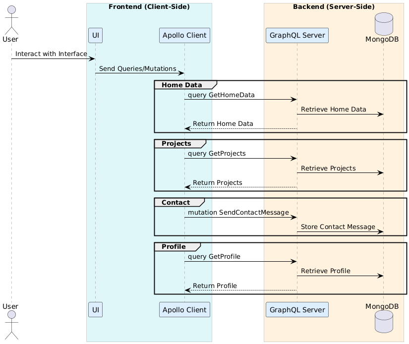

## Architecture Overview

Below is the system architecture diagram for the portfolio app:

This diagram provides an overview of the key components and their interactions within the application.

### Key Components:

- **Client-Side**:
  - **Browser**: User interface for accessing the frontend application.
  - **React App**: Main application environment using React, Vite, and React Router.
  - **Apollo Client**: Manages state and data fetching with GraphQL.

- **Server-Side**:
  - **Apollo Server**: Handles GraphQL requests and resolves queries/mutations.
  - **Schema & Resolvers**: Defines the GraphQL schema and resolver logic.
  - **Data Models**: Represents database entities using Mongoose.

- **Database**:
  - **MongoDB**: Stores data using MongoDB Atlas with Mongoose ODM.

### Communication:

- **GraphQL** is used to handle client-server interactions, providing a flexible and efficient communication protocol between the react front end and the server.
- **HTTP/HTTPS** enables secure data transmission.

### Deployment & Environment:

- **GitHub** is used for source code management.
- **GitHub Pages** hosts the static parts of the site.

### Technology Stack:

- **Frontend**: React, TypeScript, Vite, Tailwind CSS, Apollo Client.
- **Backend**: Node.js, Apollo Server, GraphQL, Hapi.js.
- **Database**: MongoDB Atlas.
- **Deployment**: Managed via GitHub Pages and environment variables.

